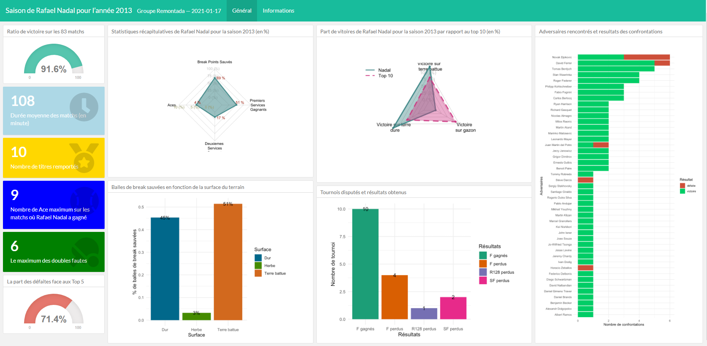
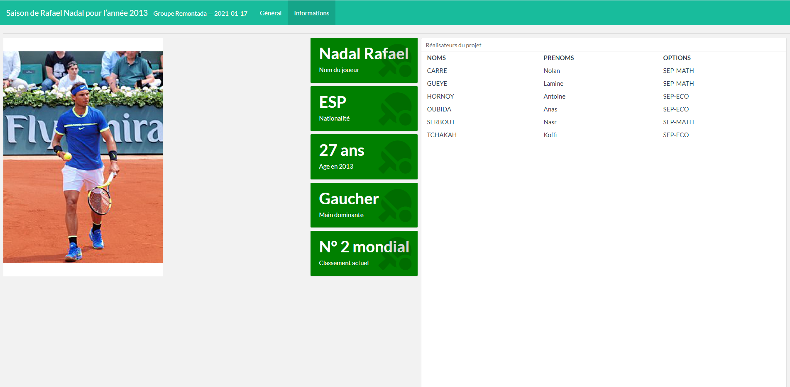

# Projet_atp
Ce projet a pour but d'atteindre les objectifs suivants : 
1. Création d’un dashboard pour visualiser la saison d’un joueur. 
2. Identification des facteurs permettant d’expliquer les retournements de situation (gagner un match en 5 sets en étant mené 2 sets à 0)

Les statistiques et représentations graphiques de notre Dashboard découlent de l'analyse des résultats de la saison 2013 de l'ATP.

Le Dashboard est composé de deux parties : la première partie résume l'analyse statistique et graphique d'un jour pour une saison donnée et la seconde partie est réservée aux informations générales concernant le joueur.

Dans le cadre de notre projet, nous avons choisi d'analyser les performances du joueur Rafael Nadal pour l'année 2013. Durant la saison, Nadal a joué 83 matchs. Il faut également noter que le code de ce projet est dynamisé. En effet dans le code "Importation.R", si l'on change la date ainsi que le nom et prénom du joueur on peut obtenir les informations d'un autre joueur sur une autre année. 

Ci-dessous les analyses statistiques et graphiques choisies pour résumer la saison de Nadal :
Il faut également noté que la visualisation du dashboard est optimale sur un écran en 1920 par 1080. Les captures d'écrans suivantes vous permettront de visualiser le résultat sur un écran de cette envergure :

  
  
  
  # Exécution du programme à partir d'un terminal
(Creer un dossier nommé "data" contenant toutes les bases de données atp.)

  Ouvrir un terminal et taper les lignes suivantes :
 - git clone https://github.com/LamineIPI/Projet_atp.git
 - cd Projet_atp
 - R CMD BATCH Importation.R
 
 Un fichier Dash.html est ensuite créé dans le dossier Projet_atp. Pour afficher le Dashboard ouvrez ce fichier dans un navigateur internet.

# Informations choisies 

## Univariées

Ces statistiques ont été choisies car elles nous semblaient pertinentes à relever pour la saison d'un joueur.

### Ratio de victoire sur la saison 
**Description** **:**  
Nadal a gagné près de 91,6% des matchs de toute la saison.      

### Durée moyenne des matchs en minutes
**Description** **:**  
La durée moyenne des matchs réalisés par Nadal est de 108 minutes.  

### Nombre de titres remportés
**Description** **:**   
Il a remporté 10 titres.  

### Nombre de Ace maximum sur les matchs où Nadal a gagné
**Description** **:**  
Le nombre maximum d'Ace sur les matchs est égal 9.   

### Le maximum des doubles fautes
**Description** **:**  
Le maximum des doubles fautes est égal à 6.   

### La part des défaites face au Top 5
**Description** **:**  
Le pourcentage des défaites face au top 5 par rapport à la totalité de ses défaites en 2013 est de 71,4%.   
     
## Graphiques de représentation

### Statistiques récapitulatives
**Description** **:**  
Le premier diagramme de Kiviat indique le nombre de services (4%),  le nombres de Ace (69%), les premiers services gagnants (51%) et les deuxièmes services (17%).   
     
**Pourquoi ce graphique ?**   
Ce graphique a été choisi car il permet de résumer plusieurs statistiques d'un joueur sur peu de place. De plus, la structure de ce diagramme permet une comparaisson entre joueur. En effet, la taille du filet (surface colorée du diagramme) est visuellement représentative ; plus le filet recouvre une surface élevée meilleur est le joueur (en général) sur ces statistiques.

### Balles de break sauvées en fonction de la surface du terrain
**Description** **:**  
L'histogramme en dessous du diagramme de Kiviat indique le nombre de balles de break sauvées en fonction de la surface du terrain. En 2013, près de 51% de balles de break sauvées ont été réalisées sur une terre battue et 45% sur un terrain dur.  
     
**Pourquoi ce graphique ?**  
Ce graphique a été choisi afin d'avoir une idée plus claire sur la performance d'un joueur en terme de balles de break sauvées sur chaque type de terrain, on sait qu'en tennis la surface du terrain joue un role trés important dans la performance du joueur en question, raison pour laquelle nous avons essayé de projeter cela sur notre variable d'intéret (balle de break sauvées).

### Part de victoires par rapport au Top 10 en pourcentage
**Description** **:**  
Le deuxième diagramme de Kiviat met en relation le nombre de matchs gagnés par Nadal, du Top 10 par surface et le taux des gains pour les Top 10 par surface.   
     
**Pourquoi ce graphique ?**   
Ce graphique a été choisi pour évaluer la performance d'un tennisman, en comparant ces résultats avec les résultats des dix premiers au classement. 

### Tournois disputés et résultats obtenus
**Description** **:**   
Nadal a gagné 10 titres et en a 7 qui se répartissent comme suit : 4 finales, 2 demi-finales et 1 R128.   
     
**Pourquoi ce graphique ?**   
Nous avons choisi de réaliser ce graphique pour observer rapidement les tournois disputés ainsi que les résultats obtenus par le joueur. 

### Adversaires rencontrés et résultats des confrontations
**Description** **:**   
Nadal a gagné la majorité des rencontres sauf avec les joueurs suivants : 3 défaites avec Novak Djokovic avec qui il a eu 6 rencontres, une défaite avec David Ferrer avec qui il a eu 6 rencontres également, une avec juan Martin Del Portro, une avec Steve Darcis et une avec Horacio Zeballos.    
     
**Pourquoi ce graphique ?**    
Ce tableau synthétise l'ensemble des matchs réalisés permettant donc de visualiser les victoires et les défaites de notre joueur face à ses différents adversaires. 

